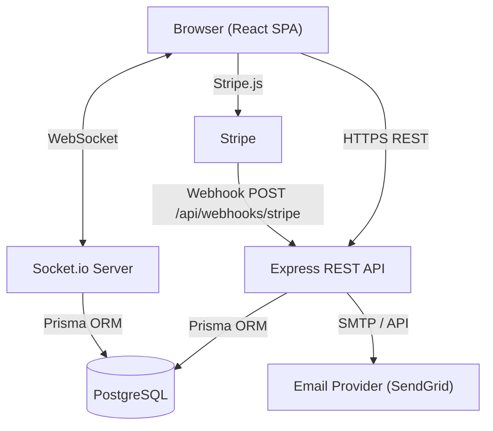
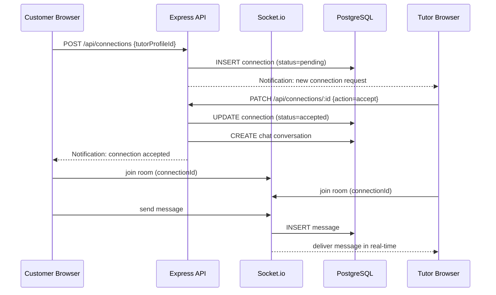
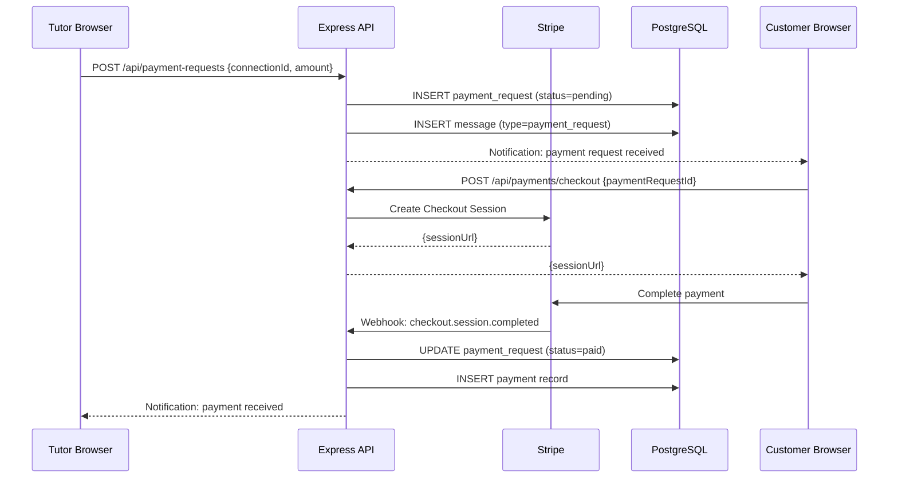
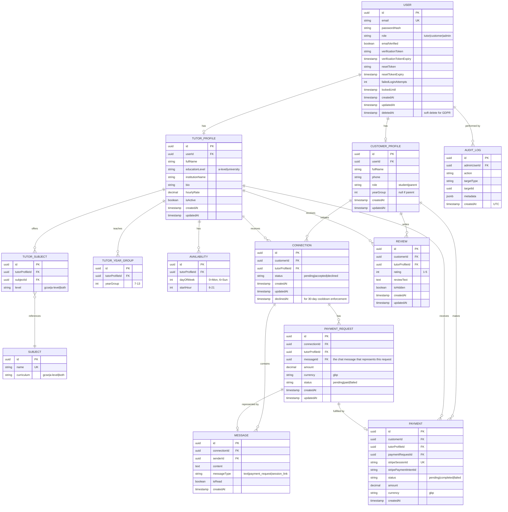

# Design Document: UK Tutor Marketplace

## Overview

The UK Tutor Marketplace is a web application that connects A-Level and University student tutors with school students (Year 7–13) and their parents. Tutors register, list their subjects and availability, and are discoverable via public search. Customers connect with tutors via a LinkedIn-style connection request flow. All communication happens in-app — tutor contact details are never shared. Once connected, tutors can send payment requests via in-app chat, and sessions are coordinated through the same chat interface.

### Key Design Goals

- Simple, low-friction registration for both tutors and customers
- Public tutor discovery (search and listing) without requiring login
- LinkedIn-style connection request flow before any communication
- Real-time in-app messaging between connected parties (contact details never shared)
- Tutor-initiated payment requests processed via Stripe from within the app
- Session coordination via chat (Google Meet links rendered as clickable links)
- GDPR-compliant data handling under UK law
- Secure authentication with bcrypt password hashing and account lockout
- Admin panel for platform operations and content moderation

### Technology Stack

| Layer | Choice | Rationale |
|---|---|---|
| Frontend | React (TypeScript) + Vite | Component-driven UI, fast dev experience |
| Backend | Node.js + Express (TypeScript) | Unified language across stack, large ecosystem |
| Database | PostgreSQL | Relational integrity for users, connections, messages, payments |
| ORM | Prisma | Type-safe queries, migration management |
| Auth | JWT (access + refresh tokens) | Stateless, scalable session management |
| Real-time | Socket.io | WebSocket-based real-time messaging |
| Payments | Stripe (Embedded or Redirect Checkout) | PCI-compliant, widely trusted in UK |
| Email | SendGrid (or AWS SES) | Transactional email for verification, notifications |
| Hosting | Railway / Render (or AWS) | Simple deployment with managed Postgres |
| Password hashing | bcrypt (cost factor 12) | Requirement 11.3 |


---

## Architecture

The system follows a three-tier architecture: React SPA frontend, Express REST API backend, and PostgreSQL database. Socket.io provides real-time messaging over WebSockets. Stripe webhooks handle asynchronous payment confirmation.



### Request Flow: Connection and Messaging



### Request Flow: Payment Request



### Authentication Flow

- JWT access token (15 min TTL) + refresh token (7 day TTL, stored in httpOnly cookie)
- Refresh endpoint issues new access token without re-login
- Failed login attempts tracked in DB; account locked for 15 min after 5 consecutive failures
- Email verification token (UUID, single-use) sent on registration
- Password reset token (UUID, single-use, 60 min TTL) sent on request


---

## Components and Interfaces

### Frontend Pages / Routes

| Route | Component | Auth Required |
|---|---|---|
| `/` | Home / Search | No |
| `/tutors` | Tutor Listing | No |
| `/tutors/:id` | Tutor Profile (with Connect button) | No (Connect requires Customer auth) |
| `/register/tutor` | Tutor Registration | No |
| `/register/customer` | Customer Registration | No |
| `/login` | Login | No |
| `/dashboard/tutor` | Tutor Dashboard | Tutor |
| `/dashboard/customer` | Customer Dashboard | Customer |
| `/messages` | Conversations List | Customer or Tutor |
| `/messages/:connectionId` | Chat Conversation | Customer or Tutor (connected) |
| `/admin` | Admin Panel | Admin |
| `/admin/users` | User Management | Admin |
| `/admin/reviews` | Review Moderation | Admin |
| `/admin/audit` | Audit Log | Admin |

### REST API Endpoints

#### Auth
```
POST   /api/auth/register/tutor
POST   /api/auth/register/customer
POST   /api/auth/login
POST   /api/auth/logout
POST   /api/auth/refresh
GET    /api/auth/verify-email?token=
POST   /api/auth/forgot-password
POST   /api/auth/reset-password
```

#### Tutors
```
GET    /api/tutors                    # public listing (paginated, 20/page)
GET    /api/tutors/search             # ?subject=&yearGroup=&day=
GET    /api/tutors/:id                # public profile
PUT    /api/tutors/:id/profile        # tutor only
PUT    /api/tutors/:id/availability   # tutor only
```

#### Customers
```
GET    /api/customers/:id             # customer only (own profile)
PUT    /api/customers/:id             # customer only
DELETE /api/customers/:id             # GDPR deletion request
```

#### Connections
```
POST   /api/connections               # customer sends connect request
PATCH  /api/connections/:id           # tutor accepts or declines {action: accept|decline}
GET    /api/connections               # list connections for logged-in user
```

#### Messages
```
GET    /api/messages/:connectionId    # get chat history (requires connection membership)
POST   /api/messages/:connectionId    # send a text message
```

#### Payment Requests
```
POST   /api/payment-requests          # tutor sends payment request {connectionId, amount}
```

#### Payments
```
POST   /api/payments/checkout         # customer initiates payment for a payment request
GET    /api/payments/history          # customer's payment history
POST   /api/webhooks/stripe           # Stripe webhook (no auth)
```

#### Reviews
```
POST   /api/tutors/:id/reviews        # customer only, requires completed payment
GET    /api/tutors/:id/reviews        # public
PUT    /api/reviews/:id               # customer only (edit own)
DELETE /api/reviews/:id               # admin only
```

#### Admin
```
GET    /api/admin/dashboard           # metrics
GET    /api/admin/users               # list/search/filter
PATCH  /api/admin/users/:id/status    # activate/deactivate
GET    /api/admin/reviews             # all reviews
DELETE /api/admin/reviews/:id         # remove review
GET    /api/admin/audit               # audit log
```


---

## Data Models

### Entity Relationship Diagram



### Key Schema Notes

- `USER.deletedAt` enables soft-delete for GDPR; a scheduled job hard-deletes records older than 30 days
- `AVAILABILITY` stores one row per (tutor, day, hour) slot — 16 possible hours × 7 days = max 112 rows per tutor
- `CONNECTION.status` transitions: `pending` → `accepted` or `declined`. Only `accepted` connections enable messaging.
- `CONNECTION.declinedAt` is set when a tutor declines; the platform rejects new requests from the same customer to the same tutor within 30 days of this timestamp
- `MESSAGE.messageType` distinguishes plain text (`text`), payment requests (`payment_request`), and session links (`session_link`). URLs in any message type are rendered as clickable links on the frontend.
- `PAYMENT_REQUEST` is linked to a `MESSAGE` row so the payment request appears inline in the chat conversation
- `PAYMENT_REQUEST.status` starts as `pending`, transitions to `paid` via Stripe webhook, or `failed` on payment failure
- `PAYMENT.paymentRequestId` links each payment to the specific payment request it fulfils
- `PAYMENT.status` starts as `pending` on Stripe session creation and transitions to `completed` via webhook
- `REVIEW.isHidden` allows admin soft-removal without data loss; average rating excludes hidden reviews
- `TUTOR_PROFILE.isActive` controls visibility in search and listing; set to false on admin deactivation
- Tutor contact details (email, phone) are stored only in `USER` and `CUSTOMER_PROFILE`/`TUTOR_PROFILE` and are never included in any API response accessible to the other party
- Passwords are never stored; only `passwordHash` (bcrypt, cost 12)


---

## Correctness Properties

*A property is a characteristic or behavior that should hold true across all valid executions of a system — essentially, a formal statement about what the system should do. Properties serve as the bridge between human-readable specifications and machine-verifiable correctness guarantees.*

### Property 1: Email format validation rejects invalid inputs

*For any* string that is not a valid RFC 5322 email address, submitting it as the email field in either the tutor or customer registration form should result in a validation error and no account being created.

**Validates: Requirements 1.2, 4.3**

---

### Property 2: Tutor registration requires at least one subject and year group

*For any* tutor registration payload where the subjects array or year groups array is empty, the registration should be rejected and no account should be created.

**Validates: Requirements 1.3**

---

### Property 3: Verification token activates account

*For any* newly registered user (tutor or customer) who has not yet verified their email, presenting the correct single-use verification token to the verification endpoint should transition the account from unverified to active.

**Validates: Requirements 1.6, 4.6**

---

### Property 4: Registration triggers a verification email

*For any* successful registration (tutor or customer), the email service should be called exactly once with the registered email address as the recipient.

**Validates: Requirements 1.5, 4.5**

---

### Property 5: Availability round-trip

*For any* tutor and any set of valid availability slots (day 0–6, hour 6–21), saving those slots and then reading the tutor's public profile should return exactly the saved slots.

**Validates: Requirements 2.2, 2.3**

---

### Property 6: Availability slots are constrained to 06:00–22:00

*For any* availability slot with a start hour outside the range 6–21 inclusive, the platform should reject the slot and return a validation error.

**Validates: Requirements 2.5**

---

### Property 7: Profile update round-trip

*For any* tutor and any valid profile update (bio, subjects, year groups, hourly rate), saving the update and then reading the public profile should return the updated values.

**Validates: Requirements 3.2, 3.3**

---

### Property 8: Public profile and search results never expose contact details

*For any* tutor, every API response accessible to customers or unauthenticated visitors — including public profile, search results, listing page, and chat messages — must never contain the tutor's email address or phone number.

**Validates: Requirements 3.4, 5.7, 7.7**

---

### Property 9: Subject search returns only matching verified tutors

*For any* subject search query, every tutor returned in the results must (a) offer that subject and (b) have a verified, active account.

**Validates: Requirements 5.2**

---

### Property 10: Year group filter returns only matching tutors

*For any* year group filter value (7–13), every tutor returned in the filtered results must have that year group listed in their taught year groups.

**Validates: Requirements 5.3**

---

### Property 11: Availability day filter returns only matching tutors

*For any* day-of-week filter (0–6), every tutor returned in the filtered results must have at least one availability slot on that day.

**Validates: Requirements 5.4**

---

### Property 12: Connection status display matches actual state

*For any* customer/tutor pair, the connection action button displayed on the tutor's profile must reflect the actual connection state: "Connect" when no request exists, "Pending" when a request is awaiting response, and "Connected" when the connection is accepted.

**Validates: Requirements 6.1, 6.7**

---

### Property 13: Connect request creates a pending connection and notifies the tutor

*For any* registered customer and any tutor with no existing active or pending connection between them, clicking "Connect" should result in a connection record with status `pending` being created, and the notification service being called for the tutor.

**Validates: Requirements 6.2**

---

### Property 14: Accepting a connection establishes it and notifies the customer

*For any* pending connection, when the tutor accepts it, the connection status must transition to `accepted` and the notification service must be called for the customer.

**Validates: Requirements 6.4**

---

### Property 15: Declined connection enforces 30-day cooldown

*For any* declined connection, any attempt by the same customer to send a new connection request to the same tutor within 30 days of the `declinedAt` timestamp must be rejected with an appropriate error.

**Validates: Requirements 6.5**

---

### Property 16: Accepted connection creates an accessible chat conversation

*For any* accepted connection, both the customer and the tutor must be able to access the chat conversation associated with that connection, and no chat must exist for a non-accepted connection.

**Validates: Requirements 7.1**

---

### Property 17: Message send round-trip

*For any* connected customer/tutor pair and any valid message content, sending a message and then retrieving the chat history should include that message with the correct sender, content, and timestamp.

**Validates: Requirements 7.2, 7.4**

---

### Property 18: Messages are displayed in chronological order

*For any* chat conversation with multiple messages, the messages returned by the chat history endpoint must be ordered by `createdAt` ascending (oldest first).

**Validates: Requirements 7.3**

---

### Property 19: Unread message count matches actual unread messages

*For any* user, the unread message count indicator must equal the number of messages in their conversations where `isRead` is false and the sender is the other party.

**Validates: Requirements 7.5**

---

### Property 20: New message triggers a notification to the recipient

*For any* message sent in a chat conversation, the notification service must be called exactly once with the recipient's user ID.

**Validates: Requirements 7.6**

---

### Property 21: Only connected tutors can send payment requests

*For any* payment request submission, the request must be rejected unless the tutor and customer share an accepted connection.

**Validates: Requirements 8.1**

---

### Property 22: Payment request appears in chat and notifies the customer

*For any* payment request sent by a tutor, a message of type `payment_request` must appear in the associated chat conversation, and the notification service must be called for the customer.

**Validates: Requirements 8.2**

---

### Property 23: Payment completion records the payment and notifies the tutor

*For any* completed Stripe payment for a payment request, the payment request status must transition to `paid`, a payment record must be inserted, and the notification service must be called for the tutor.

**Validates: Requirements 8.4**

---

### Property 24: URLs in chat messages are rendered as clickable links

*For any* message whose content contains a valid URL, the frontend rendering of that message must include a clickable anchor element pointing to that URL.

**Validates: Requirements 9.1**

---

### Property 25: Listing page pagination enforces 20-per-page maximum

*For any* page of the tutor listing, the number of tutor profiles returned must be greater than zero (unless no tutors exist) and at most 20.

**Validates: Requirements 10.3**

---

### Property 26: Account lockout after 5 consecutive failed logins

*For any* user account, after exactly 5 consecutive failed login attempts, subsequent login attempts must be rejected with a lockout error for at least 15 minutes.

**Validates: Requirements 11.2**

---

### Property 27: Passwords are stored as bcrypt hashes

*For any* user account, the stored credential must be a valid bcrypt hash and must not equal the plain-text password provided at registration.

**Validates: Requirements 11.3**

---

### Property 28: Password reset token has a 60-minute TTL

*For any* password reset request, the generated token's expiry timestamp must be within 60 minutes (±1 minute tolerance) of the request time, and the token must be rejected after expiry.

**Validates: Requirements 11.5, 11.6**

---

### Property 29: Registration requires acceptance of Privacy Policy and ToS

*For any* registration payload that does not include explicit acceptance of the Privacy Policy and Terms of Service, the registration must be rejected and no account created.

**Validates: Requirements 13.2**

---

### Property 30: Account deletion marks user data for removal within 30 days

*For any* user who submits a deletion request, the user's record must be soft-deleted immediately (deletedAt set), and the record must be permanently removed within 30 days.

**Validates: Requirements 13.4**

---

### Property 31: Only customers with a completed payment can submit reviews

*For any* customer attempting to submit a review for a tutor, the review must be rejected unless a payment record with status `completed` exists for that customer/tutor pair.

**Validates: Requirements 14.1**

---

### Property 32: Review rating must be an integer between 1 and 5

*For any* review submission, a rating value outside the integer range [1, 5] must be rejected with a validation error.

**Validates: Requirements 14.2**

---

### Property 33: Review display includes required fields and excludes private fields

*For any* review, the public display must include the reviewer's first name, star rating, review text, and submission date, and must not include the reviewer's email address, phone number, or full surname.

**Validates: Requirements 14.4, 14.5**

---

### Property 34: Average rating calculation is correct and rounded to 1 decimal place

*For any* set of non-hidden reviews for a tutor, the displayed average rating must equal the arithmetic mean of all ratings rounded to one decimal place.

**Validates: Requirements 14.6**

---

### Property 35: One review per customer per tutor

*For any* customer/tutor pair, attempting to submit a second review must be rejected, and the existing review must remain unchanged.

**Validates: Requirements 14.8, 14.9**

---

### Property 36: Non-admin users receive 403 on admin routes

*For any* request to an admin API endpoint made by a user without the Administrator role (including unauthenticated requests), the response must be HTTP 403.

**Validates: Requirements 15.1, 15.2**

---

### Property 37: Deactivated tutor is excluded from search and listing

*For any* tutor whose account is deactivated by an administrator, that tutor must not appear in any search results or on the tutor listing page.

**Validates: Requirements 15.5**

---

### Property 38: Reactivation restores tutor visibility

*For any* tutor who was deactivated and then reactivated by an administrator, that tutor must appear in search results and on the tutor listing page after reactivation.

**Validates: Requirements 15.6**

---

### Property 39: Review removal hides review and recalculates average

*For any* review removed by an administrator, the review must be hidden from the tutor's public profile and the tutor's average rating must be recalculated excluding the removed review.

**Validates: Requirements 15.8**

---

### Property 40: Admin actions are recorded in the audit log

*For any* administrative action (deactivate user, reactivate user, remove review), an audit log entry must be created containing the administrator's user ID, the action name, the target entity ID, and a UTC timestamp.

**Validates: Requirements 15.9**


---

## Error Handling

### Validation Errors (HTTP 400)
- Invalid email format on registration
- Missing required registration fields
- Empty subjects or year groups array on tutor registration
- Rating outside 1–5 on review submission
- Availability slot outside 06:00–22:00
- Registration without ToS/Privacy Policy acceptance
- Payment request with invalid or zero amount

### Authentication Errors (HTTP 401)
- Missing or expired JWT access token
- Invalid credentials on login
- Unverified email on login attempt

### Authorization Errors (HTTP 403)
- Non-admin accessing admin routes
- Customer accessing another customer's data
- Tutor accessing another tutor's private data
- Attempting to send a message to a non-accepted connection
- Attempting to send a payment request without an accepted connection
- Customer attempting to access a chat they are not a party to

### Conflict Errors (HTTP 409)
- Duplicate email on registration
- Second review submission for same tutor/customer pair
- Connection request sent within 30-day cooldown period
- Duplicate connection request when one is already pending or accepted

### Not Found (HTTP 404)
- Tutor profile not found
- Connection not found
- Message conversation not found
- Payment request not found

### Payment Errors
- Stripe session creation failure → return 502 with user-friendly message
- Stripe webhook signature verification failure → return 400, log the event
- Payment status `failed` → payment request remains in `pending` state, error shown to customer

### Account Lockout
- After 5 consecutive failed logins: account locked for 15 minutes, lockout email sent
- Locked account login attempts return HTTP 423 with time-remaining in response body

### Connection Cooldown
- Declined connection request: `declinedAt` timestamp recorded
- New request within 30 days returns HTTP 409 with days-remaining in response body

### GDPR Deletion
- Deletion requests are soft-deleted immediately (deletedAt set)
- A scheduled job (runs daily) hard-deletes records where `deletedAt < NOW() - 30 days`
- Associated payments are anonymised (customer FK set to null) rather than deleted to preserve financial records
- Messages in deleted user's conversations are anonymised (senderId set to null, content replaced with "[deleted]")

### Email Delivery Failures
- Verification/confirmation email failures are logged but do not block registration
- A retry mechanism (3 attempts, exponential backoff) is used for transactional emails
- Users can request a resend of the verification email

### WebSocket Errors
- If a Socket.io connection drops, the client reconnects automatically with exponential backoff
- Messages sent while disconnected are delivered on reconnect via the REST chat history endpoint
- Socket.io rooms are scoped to `connectionId` to prevent cross-conversation message leakage

---

## Testing Strategy

### Dual Testing Approach

Both unit tests and property-based tests are required. They are complementary:
- Unit tests catch concrete bugs in specific scenarios and edge cases
- Property-based tests verify universal correctness across a wide range of generated inputs

### Unit Tests

Framework: **Jest** (Node.js/TypeScript)

Focus on:
- Specific examples demonstrating correct behaviour (e.g., known valid/invalid email strings)
- Integration points (e.g., Stripe webhook handler correctly updates payment request and payment status)
- Edge cases (e.g., tutor with zero reviews, account locked exactly at attempt 5, connection request on day 30 of cooldown)
- Error conditions (e.g., expired reset token, failed payment, message sent to non-accepted connection)

Key unit test areas:
- Auth middleware (JWT validation, role checks)
- Stripe webhook signature verification
- Email service mock integration
- Admin panel 403 enforcement
- Profanity filter on review submission
- Pagination boundary (exactly 20 results, 0 results)
- Connection state machine transitions
- Socket.io room join/leave on connection accept/decline

### Property-Based Tests

Framework: **fast-check** (TypeScript property-based testing library)

Each property test must run a minimum of **100 iterations**.

Each test must include a comment tag in the format:
`// Feature: uk-tutor-marketplace, Property {N}: {property_text}`

Each correctness property defined above must be implemented by a single property-based test.

| Property | Test Description | Generator Inputs |
|---|---|---|
| P1 | Email validation rejects invalid strings | Arbitrary strings, valid/invalid email strings |
| P2 | Tutor registration rejects empty subjects/year groups | Registration payloads with empty arrays |
| P3 | Verification token activates account | Random UUID tokens, user records |
| P4 | Registration triggers email | Random valid registration payloads |
| P5 | Availability round-trip | Random slot sets (day 0–6, hour 6–21) |
| P6 | Slots outside 06:00–22:00 rejected | Hours outside [6,21] |
| P7 | Profile update round-trip | Random valid profile update payloads |
| P8 | Public profile/search/chat never exposes contact details | Random tutor records, API response shapes |
| P9 | Subject search returns matching verified tutors | Random subject strings, tutor datasets |
| P10 | Year group filter returns matching tutors | Year groups 7–13, tutor datasets |
| P11 | Day filter returns matching tutors | Days 0–6, tutor datasets |
| P12 | Connection status display matches actual state | Random customer/tutor pairs, connection states |
| P13 | Connect request creates pending connection and notifies tutor | Random customer/tutor pairs |
| P14 | Accepting connection establishes it and notifies customer | Random pending connections |
| P15 | Declined connection enforces 30-day cooldown | Random declined connections, request timestamps |
| P16 | Accepted connection creates accessible chat | Random accepted/non-accepted connections |
| P17 | Message send round-trip | Random connected pairs, message content |
| P18 | Messages in chronological order | Random message sets with varying timestamps |
| P19 | Unread count matches actual unread messages | Random message sets with read/unread states |
| P20 | New message triggers notification | Random connected pairs, message sends |
| P21 | Only connected tutors can send payment requests | Random tutor/customer pairs, connection states |
| P22 | Payment request appears in chat and notifies customer | Random connected pairs, payment amounts |
| P23 | Payment completion records payment and notifies tutor | Random Stripe webhook events |
| P24 | URLs in messages rendered as clickable links | Random message content with/without URLs |
| P25 | Listing pagination ≤ 20 per page | Random tutor counts, page numbers |
| P26 | Account lockout after 5 failures | Random user accounts, login attempt sequences |
| P27 | Passwords stored as bcrypt hashes | Random password strings |
| P28 | Reset token has 60-min TTL | Random reset request timestamps |
| P29 | Registration requires ToS acceptance | Registration payloads with/without acceptance flag |
| P30 | Deletion marks data for removal | Random user records |
| P31 | Only paying customers can review | Customer/tutor pairs with/without completed payment |
| P32 | Rating must be integer 1–5 | Arbitrary integers and non-integers |
| P33 | Review display includes/excludes correct fields | Random review records |
| P34 | Average rating calculation | Random sets of integer ratings 1–5 |
| P35 | One review per customer per tutor | Random customer/tutor pairs, multiple submissions |
| P36 | Non-admin gets 403 on admin routes | Random non-admin user roles |
| P37 | Deactivated tutor excluded from results | Random tutor datasets with deactivated entries |
| P38 | Reactivation restores tutor visibility | Random deactivated tutors |
| P39 | Review removal hides and recalculates average | Random review sets with one removed |
| P40 | Admin actions recorded in audit log | Random admin actions |

### Test File Structure

```
src/
  __tests__/
    unit/
      auth.test.ts
      availability.test.ts
      connections.test.ts
      messages.test.ts
      payment-requests.test.ts
      reviews.test.ts
      payments.test.ts
      admin.test.ts
      search.test.ts
    property/
      auth.property.test.ts           # P1, P3, P4, P26, P27, P28, P29
      availability.property.test.ts   # P5, P6
      profile.property.test.ts        # P2, P7, P8
      search.property.test.ts         # P9, P10, P11
      connections.property.test.ts    # P12, P13, P14, P15, P16
      messages.property.test.ts       # P17, P18, P19, P20, P24
      payment-requests.property.test.ts # P21, P22, P23
      listing.property.test.ts        # P25
      gdpr.property.test.ts           # P30
      reviews.property.test.ts        # P31, P32, P33, P34, P35
      admin.property.test.ts          # P36, P37, P38, P39, P40
```

### Future Considerations (Out of Scope)

- Native in-app video sessions (currently handled via Google Meet links shared in chat)
- Mobile native applications
- Tutor background verification / DBS check integration
